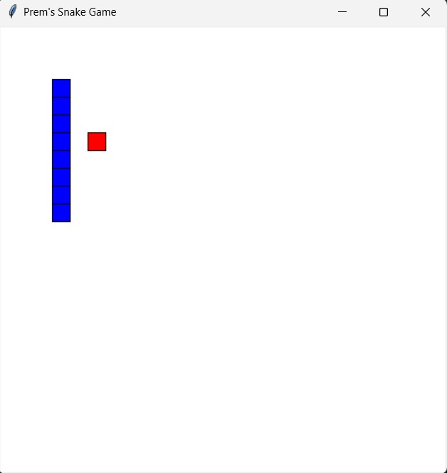
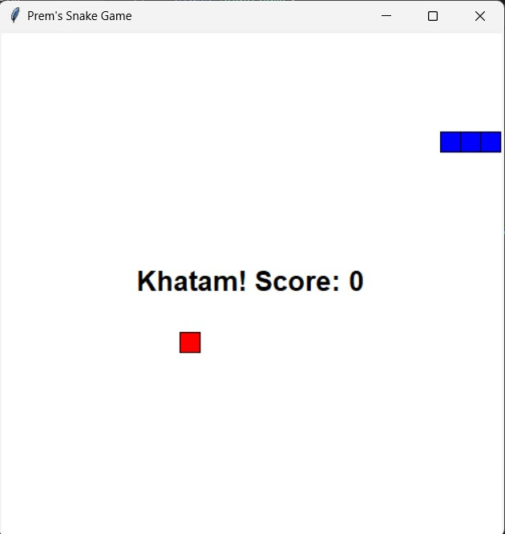

# Snake Game 🐍🎮  

A simple **Snake Game** built using Python and `tkinter`. Navigate the snake to eat food, grow, and score points while avoiding collisions with walls or its own body. This project demonstrates basic game logic and GUI development concepts in Python.  

---

## Features  
- **Graphical Interface**: Built with `tkinter` for smooth gameplay.  
- **Keyboard Controls**: Control the snake using arrow keys.  
- **Dynamic Gameplay**: Random food placement and increasing snake size.  
- **Game Over Screen**: Displays the final score after collision.  

---

## How to Play  
1. Clone this repository and run the script.  
2. Use the arrow keys (`Up`, `Down`, `Left`, `Right`) to move the snake.  
3. Guide the snake to eat the red food blocks.  
4. Avoid crashing into walls or the snake's body.  
5. The game ends upon collision, and your score will be displayed.  

---

## Installation  
1. Ensure Python (3.6 or later) is installed on your system.  
2. Clone the repository:  
   ```bash
   git clone https://github.com/soypremshandilya/snake-game.git
   cd snake-game
   ```  
3. Run the game:  
   ```bash
   python snake_game.py
   ```  

---

## Code Preview  

```python
# Move the snake
def move_snake(self):
    head_x, head_y = self.snake[0]
    move_x, move_y = DIRECTIONS[self.direction]
    new_head = (head_x + move_x, head_y + move_y)

    if new_head in self.snake or ... :
        self.running = False
        return
    self.snake.insert(0, new_head)
```

---

## Screenshot  

  


---

## Contributing  
Contributions are welcome! Feel free to fork this repository, make changes, and submit a pull request.  
